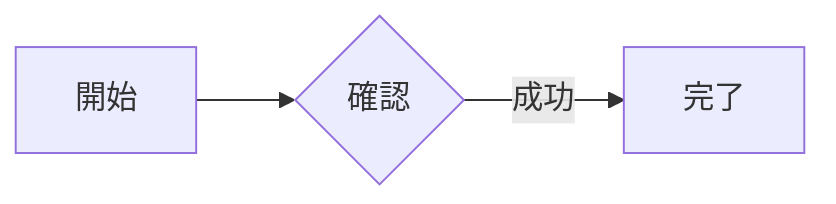

# UI 开发指南

工作空间负责任务启动、待办与总结；执行历史负责单次 Run 的完整记录。页面实现见 [web/src](../../SKM/web/src/)，提交与恢复边界见[运行维护指南](../development/runtime-guide.md)。

## 视觉规范

新增页面延续现有工作台，通过留白、对齐和信息层级提高可读性，不另建视觉系统。

- 复用暖灰夜间、奶油色日间与少量暖色主操作，沿用[共享样式](../../SKM/web/src/styles/base.css)、[阅读布局](../../SKM/web/src/styles/reading.css)和[线性图标](../../SKM/web/src/components/routeIcons.tsx)。
- 每个操作区一个主要动作。标题、状态、正文、工具栏与分页分组；长文本换行，不缩小字号或横向撑破页面。列表标题用任务名称，历史执行名称从原绑定版本读取；ID、版本与校验值放技术详情。
- 列表保留常用主动作，改名、移动、停用与删除等管理操作收进常驻的 `⋯` 菜单；不依赖悬停才能发现。文件名直接预览，无法预览时下载；目录复选框只选择当前筛选范围，批量操作仅在有选中项时显示。菜单复用原权限、确认与请求处理，支持键盘和窄屏。
- 跨页使用侧栏，同页模式使用页签。工作空间的待处理、执行中、报告保持同一宽度；空态仍保留切换与返回入口。
- 只保留影响选择、操作后果和结果判断的说明。标题或内容已说明用途时，不重复放常驻提示。错误显示失败位置、原因和下一步；权限、未知结果与未保存内容不可隐藏。
- 短说明用折叠，资源、证据和评价用抽屉，确认用小弹窗，不嵌套弹窗。保留键盘、焦点、Escape、长文本和滚动行为。
- 候选路径较多时先显示数量，展开后可滚动查看完整列表；必要状态和缺失原因始终可见，不让路径清单挤压主要操作。
- 三语统一使用消息目录。日间/夜间切换不重建表单；浏览器存储受限时仍可在当前页使用，默认主题遵从现有应用设置。

単一選択の下拉は共有 `Select` Component と Base UI の Select primitive で統一する。browser 固有の `appearance: base-select` に依存せず、境界・影・選択色と checkmark を持つ popup を全対応 browser で描画する。option/optgroup の値と無効状態を保ち、フォームの name/required と label、keyboard/typeahead/focus/dismissal は共有実装で扱う。長い選択肢は popup 内で折り返して scroll できる。親 dialog は popup が処理する Escape を奪わない。複数選択と size listbox は別の native control として扱う。

文書の upload 先は自由入力できる `DocumentFolderInput` を使い、native datalist ではなく Base UI Autocomplete の候補を表示する。既存の階層パスと root を選べ、新規パスは候補にない状態でも保持する。Escape/候補の非同期更新は入力先を変更せず、upload 中などの無効化時は候補を閉じる。

言語・状態・評価の点数・boolean・調度の短い候補は明示的な compact density を使い、不要な popup 余白と scrollbar 領域を抑える。短い form field の幅は個別に制限し、trigger の高さと他の入力との整列を保つ。任意 enum、資源・文書・path や長い説明には一律適用しない。checkmark の固定 slot、keyboard/focus と狭い viewport の scroll は維持し、touch の候補高は通常と同じにする。

操作 menu は内容に応じた幅と viewport 上限を持ち、短い操作に空の scrollbar 領域を予約しない。scroll が必要な長い一覧だけ左右の gutter を揃え、長い label は折り返す。削除・回収の確認は専用の短い dialog を使い、対象名・path/ID と影響を省略しない。対象一覧だけを有界 scroll にし、狭幅では操作 button を折り返す。

通常の Popup と有界の候補・操作一覧は classic scrollbar の予約領域を両側に揃え、項目の左右余白を対称に保つ。Select の checkmark は未選択行にも不可視の領域を確保し、選択切替で本文の幅を変えない。ページ内で伸びる一覧や短い dialog には空の scrollbar 領域を予約せず、dialog 本文は見出しの左端と揃える。

Checkbox/radio は text input の幅・最小高・padding を継承させず、既存の小さな本体と label の操作領域を分ける。sidebar の自描画 Select には native arrow 用の右余白を加えない。同階層の Select/操作 menu は共通の境界・短い硬影を使い、dialog は本文の読みやすさと柔らかい overlay を保つ。

Tab は現在項目だけを Tab 順序に置き、矢印/Home/End、tab と panel の ID 関係を共通部品で維持する。切替だけで入力草稿や未確認要求を破棄しない。有界の原文・監査領域には必要な keyboard 入口と名前を付け、背景での再読込は一覧と現在の focus を残す。

PC 1440×900 为主，兼顾 1366×768、1920×1080、三语及双主题；390px 窄屏保留可操作性。实际颜色、字号和间距以共享样式为准，不在文档复制 CSS 数值。

## 导航与任务

[统一路由](../../SKM/web/src/lib/routing.ts)负责精确 Project/Run/Task。概览、工作空间、报告、调度及历史中的执行链接统一打开历史详情，侧栏也选中执行历史。切换项目清除旧 Run/Task，失效链接不自动跳到其他项目。
确认删除当前项目后清除该目标并提示选择项目；删除响应未知时保留原目标用于核对，不误报删除成功。

归档项目的完全删除统一清理已结束的执行（含回收站）、项目文档、定期执行和项目配置；确认画面明确包含原始输入文档。组织 Skill、外部业务数据和独立审计保留。活动或结果未确认的操作仍需先结束或核对。文件清理在数据库提交后执行，失败时保留清理记录并显示未清理件数。

任务列表按名称、任务标识和定期执行状态检索；卡片显示调度状态及下次时间，设置入口保留在任务卡片，不增加独立调度 Tab。定期执行提供每天、每周和高级 cron 设置，共用原时间预览与保存校验；切换显示模式不改写已有规则。
启动表单与调度复用 [TaskLaunchFields](../../SKM/web/src/components/TaskLaunchFields.tsx) 和 taskDraft。弹窗内选定的精确任务不被目录刷新或模块默认值替换；目录文档范围一次选择目录及子目录中的可用文档。

## 报告与预览

「完成与报告」按任务显示最新终态执行的总结、状态、耗时与详情入口。最新失败或取消时不回退旧成功报告。附件、证据、评价及技术记录集中在执行详情，长附件列表优先显示结果引用项，其余可展开；项目/任务切换立即隔离旧响应。

平台模板使用已有结果字段排版，保留业务结论、限制及引用，不根据 SUCCEEDED 推断 PASS。旧 HTML 报告仍可查看；Markdown 使用共享阅读组件，JSON 只格式化显示且保留数值精度、重复字段和原始下载字节。

HTML 预览沿用 sanitizer 和无脚本 sandbox，禁止外部资源及导航。附件按原 Run、hash、大小和当前授权校验；不可用时明确说明，不推测内容或为展示重跑模型。

文書庫の PNG/JPEG/GIF は認証付き content endpoint から byte を読み、MIME・署名を検証して画像要素に表示する。SVG と未対応形式は download のまま保持する。画像・文字文書の preview は共通の 20 MB（20,000,000 byte）上限を使い、metadata だけでなく実 byte も確認する。画像の読取・decode 失敗を表示し、閉鎖・対象切替で Blob URL を破棄する。Run 添付も共有 preview 表示を使うが、添付の公開・保存契約自体は従来の 1 MiB のまま変更しない。

文書管理・報告・抜粋は共有 Markdown preview を使う。JSON 内の抜粋は UTF-8 本文 byte で同じ入場上限を確認し、元 Office 文書の圧縮 file size や JavaScript の文字数とは混同しない。大きい Markdown の全文解析は取消可能な Worker に移し、表を行境界で分割して表頭を再掲し、現在頁だけを表示する。部分表の抜粋は同一 Run・path・hash の原読取記録で確認できた表頭と完全な行だけを表示投影へ補い、原 Evidence は変更しない。確認できない文脈を現在の同名文書や推測で補わない。参照 link は全文解析で解決するが、報告・抜粋の raw HTML は従来通り実行せず文字として表示する。

内部の頁量・token 複雑度予算は入場制限と別に維持する。不可分の巨大 block は理由付きの原文頁とし、解析失敗・Worker 非対応・期限切れも明示して原文頁へ降級する。原文・plain text も同じ頁部品を使い、全文を一度に DOM 化しない。大きい HTML は既存 sanitizer の主 thread 負荷を増やさず、説明付きの原文頁へ切り替える。原 file の download は保持する。

明示的な `mermaid` code fence の基本 flowchart/graph は、文書・抜粋の共有 preview で静的なフローチャートとして表示する。通常の `A→B→C` 本文から図を推測しない。例：

図の依存は現在頁に有効な図がある時だけ遅延読込する。配色は親画面の theme に追随し、SVG は元寸法の 80% を上限として狭幅へ縮小する。長い図は有界の領域でスクロールし、初期 iframe 背景も親画面へ揃える。DSL は基本ノード・矢印・短いラベルへ再構成し、click・URL・HTML・画像・設定指令・style 等の拡張構文は実行しない。出力 SVG も既存 sanitizer と無脚本 sandbox/CSP を通し、図の CSS をアプリ本文へ漏らさない。未対応構文・不正な図・描画予算超過・読込失敗は理由と元の code を表示する。Mermaid の layout は有界の main thread 処理であり、取消は遅延応答の採用と後続描画を止めるもので、実行中の同期 layout を強制中断するものではない。

## 管理操作与异步状态

文档/目录管理、历史回收站与账户表单复用既有身份、防重、版本冲突和未知结果处理。已发送请求与草稿分开，通信失败不证明回滚；按原请求核对，不生成新 key 自动重发。关闭弹窗、切换目标或卸载后，旧响应不能覆盖当前内容。

入力 JSON の編集中の不正な文字列も草稿として保持する。解析成功だけを textarea の値に採用せず、未解決の構文/型エラーが残る間は実行・調度の送信を止める。高度 JSON editor は有効性で別 DOM へ置き換えない。

Skill の解析・保存・解釈は確認済み原文 snapshot に対応させる。原文または入力元の変更後は旧結果を現在結果として使わず、再解析を案内する。結果不明の要求とその照合入口は新しい草稿とは独立して保持する。

候補、Project 有効化、module、task、資源 catalog は loading/error/ready-empty を区別する。読取失敗から「未設定」「未有効化」や別範囲の成功一覧を作らない。再試行は読取だけを行い、未知 write の自動再送にはしない。

Skill 版本按技能归组，其他版本可展开并保留原版操作；成员候选中的已加入或停用用户按当前页折叠，不改写服务端总数。

筛选、分页与计数使用服务端事实，完整列表可本地筛选，不能筛第一页冒充全量。单页省略无效翻页按钮，流式审计数量明确表示已加载件数。搜索目录时显露命中路径，空目录也应可找到。已选项随目标切换清理；确认弹窗说明实际影响，不新加无关前置条件。

异步解析完成后保留原请求引用供刷新恢复，不能为恢复显示再次调用模型；开始新原文或成功创建草稿后结束该临时引用。

## 验证入口

运行[页面回归](../development/local-development.md#ブラウザ回帰)，共用布局调整覆盖双主题、三语、PC 与窄屏；至少检查空态、多记录、长名称、键盘、失败及延迟响应。
[全站检查](../../SKM/web/tests/browser/check_visual_style.py)和[阅读检查](../../SKM/web/tests/browser/check_reading.py)使用 mock；真实部署的字体、权限、网络与持久化另行验证。
